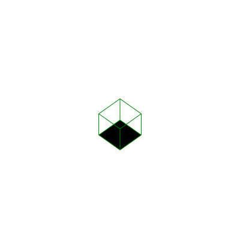

Generate svg with isometric 3D

this repo is a dirty draft for now

input is test.3dsvg a each line represent a line starting point (A) and ending point (B)
Xa,Ya,Za,Xb,Yb,Zb

currently the test.3dsvg represent a cube and the result looks like this:
(rotation matrix needs to be fixed, that's why it's sideways)

